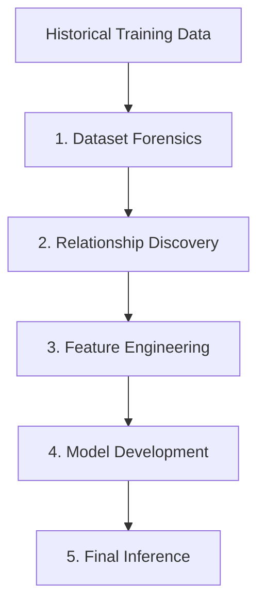
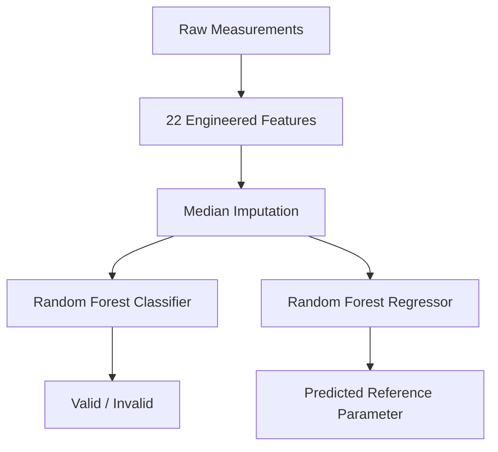
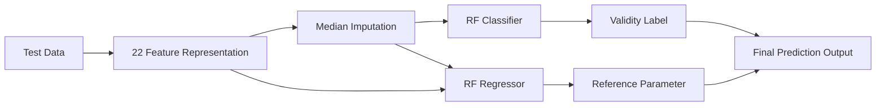

# 0xPOWER — Black-Box Test Bench Intelligence

> An end-to-end machine learning pipeline for detecting invalid test-bench records and predicting an unknown reference parameter from operating conditions and sensor measurements.

## 1. The Case Study

Modern test benches generate large volumes of measurements across different operating conditions. In a black-box setting, however, we may have the measurements without having access to the underlying physical model that produced them.

The PowerNext AI / CPRI Black-Box Test Bench Challenge presented this exact problem.

We were provided with historical test-bench records containing:

- Operating parameters
- Multiple sensor measurements
- A Reference_Parameter
- A Validity_Label

For a new batch of test records, the Reference_Parameter and Validity_Label were hidden.

Our task was therefore to infer two things from the observable measurements:

1. Is the test record Valid or Invalid?
2. What is the expected Reference_Parameter?

The problem becomes more interesting because an unusual measurement is not necessarily an erroneous one. A genuine change in operating conditions can produce unusual sensor values, while a corrupted sensor reading may look numerically reasonable but be inconsistent with the behaviour of other sensors.

This led us to treat the challenge as a combination of behavioural analysis, anomaly detection and supervised prediction.

## 2. The Challenge

### Different operating conditions

The relationship between the sensors and the reference parameter is not purely linear. Sensor behaviour changes with parameters such as voltage and load current.

### Sensor inconsistency

A faulty record may not contain an obviously extreme value. Instead, the relationship between sensors can become inconsistent.

### Missing measurements

Some records contain missing sensor values, and missingness itself can carry information about validity.

### Duplicate or repeated measurements

Repeated measurement combinations can contain conflicting target values, making naive duplicate removal potentially dangerous.

### Hidden test distribution

The final model had to operate on an unseen test dataset. Therefore, a model that performs well on training data alone is not sufficient.

> Can relationships between sensors and operating conditions provide enough information to distinguish genuine operating behaviour from corrupted or invalid measurements?

## 3. Our Approach

We approached the problem as a progression from forensic data understanding to inference-ready modelling.



### 3.1 Dataset Forensics

Before modelling, we investigated the structure and quality of the historical data.

We examined:

* Dataset dimensions and schema
* Data types
* Missing values
* Duplicate measurement combinations
* Target distributions
* Feature distributions
* Correlations
* Valid vs Invalid records
* Missingness patterns

One of the important observations was that missingness did not behave identically across all sensors. Some missing sensor values were strongly associated with invalid records, while another sensor's missingness showed a different relationship with validity.

We also investigated repeated measurement combinations and found cases where identical observable measurements could correspond to different reference values.

This established that the dataset required relationship-aware analysis rather than simple threshold-based filtering.

[Open Dataset Forensics →](notebooks/01_dataset_forensics.ipynb)

### 3.2 Relationship Discovery

We then investigated how the operating parameters and sensors interacted.

The strongest relationships with Reference_Parameter included:

* Load_Current_A
* Sensor_S2
* Sensor_S1
* Sensor_S3

We also examined relationships between the sensors themselves.

This was particularly important because the sensors were not independent. Several sensors showed strong correlations with one another and with the applied voltage.

Instead of asking only:

"Is this sensor value unusually high?"

we asked:

"Is this sensor behaving consistently with the other sensors under the current operating conditions?"

This became the foundation of our feature-engineering strategy.

[Open Relationship Discovery →](notebooks/02_relationship_discovery.ipynb)

### 3.3 Feature Engineering

Based on the forensic and relationship analysis, we constructed an inference-safe feature representation.

The final feature set contained 22 features.

#### Raw operating parameters

```text
Applied_Voltage_kV
Load_Current_A
Ambient_Temperature_C
Test_Duration_min
```

#### Raw sensor measurements

```text
Sensor_S1
Sensor_S2
Sensor_S3
Sensor_S4
```

#### Sensor residuals

```text
S2_S1_residual
S3_S1_residual
S3_S2_residual
```

These capture relative differences between sensors rather than considering each sensor independently.

#### Absolute residuals

```text
S2_S1_residual_abs
S3_S1_residual_abs
S3_S2_residual_abs
```

These capture the magnitude of sensor disagreement regardless of direction.

#### Pairwise differences

```text
S2_minus_S1
S3_minus_S1
S3_minus_S2
```

#### Operating interaction

```text
Voltage_Current
```

#### Missingness indicators

```text
Sensor_S1_missing
Sensor_S2_missing
Sensor_S3_missing
Sensor_S4_missing
```

These explicitly indicate whether a sensor measurement was missing.

> Importantly, all final features were inference-safe: they could be calculated for both training and test records without using the hidden target.

[Open Feature Engineering →](notebooks/03_feature_engineering.ipynb)

### 3.4 Model Development

We treated the problem as two supervised-learning tasks.

#### Task 1 — Validity Classification

The objective was to identify potentially invalid records.

We initially established baseline models and then investigated nonlinear models.

The final classifier was a Random Forest Classifier with:

```text
n_estimators = 500
max_depth = 20
max_features = 0.5
class_weight = balanced
min_samples_split = 2
min_samples_leaf = 1
random_state = 42
```

The Invalid class was explicitly encoded as:

```text
Valid   → 0
Invalid → 1
```

We used a tuned Invalid probability threshold of:

```text
0.415
```

rather than assuming the default 0.5 threshold.

#### Task 2 — Reference Parameter Prediction

For the continuous Reference_Parameter, we compared linear and nonlinear approaches.

The final model was a Random Forest Regressor:

```text
n_estimators = 500
max_depth = None
max_features = 1.0
min_samples_split = 2
min_samples_leaf = 1
random_state = 42
```

Median imputation was fitted on the training data and reused during inference.



The final pipeline combines classification and regression.

[Open Model Development →](notebooks/04_model_development.ipynb)

### 3.5 Final Inference

Once the modelling decisions were finalized, the pipeline was applied to the hidden test data in the same feature space used during development.



Once the models and feature representation were finalized, we built an automated inference pipeline that:

* builds the same 22 features
* applies the training-fitted imputation
* predicts Invalid probability
* applies the 0.415 threshold
* predicts Reference_Parameter
* generates the final prediction output
* performs output validation checks

[Open Final Model & Submission →](notebooks/05_final_model.ipynb)

## 4. Validation & Model Development Results

These values represent model-development/validation results and should not be interpreted as performance on the hidden evaluator dataset.

| Task                    | Model         |            Metric | Result |
| ----------------------- | ------------- | ----------------: | -----: |
| Validity Classification | Random Forest |                F1 | ~0.965 |
| Validity Classification | Random Forest |           ROC-AUC | ~0.985 |
| Validity Classification | Random Forest | Balanced Accuracy | ~0.973 |
| Reference Prediction    | Random Forest |               MAE | ~0.992 |
| Reference Prediction    | Random Forest |              RMSE | ~2.185 |
| Reference Prediction    | Random Forest |                R² | ~0.954 |

* F1 measures the balance between precision and recall for the Invalid class.
* ROC-AUC measures how well the classifier separates Valid and Invalid records.
* Balanced Accuracy accounts for class imbalance.
* MAE measures average absolute regression error.
* RMSE gives greater weight to larger errors.
* R² measures the proportion of target variance explained by the regression model.

## 5. Evaluation on the Unseen Test-1 Dataset

The evaluator's hidden Test-1 dataset contained 350 records.

Our submitted predictions produced:

| Metric            | Result |
| ----------------- | -----: |
| MAPE              | 2.584% |
| MAE               | 0.7469 |
| Invalid Precision |  95.0% |
| Invalid Recall    |  82.6% |
| Invalid F1        | 88.37% |

### Invalid-class confusion matrix

|                | Predicted Invalid | Predicted Valid |
| -------------- | ----------------: | --------------: |
| Actual Invalid |                38 |               8 |
| Actual Valid   |                 2 |             302 |

This means the classifier correctly identified 38 of 46 Invalid records, while producing only 2 false Invalid predictions.

The evaluator's overall results were:

```text
Overall score:   28.71 / 80
Rank:            181 / 234
Reproducibility: 8 / 10
Engineering:     7 / 10
```

The qualitative rubric results were:

* Structure: 3/3
* Pipeline completeness: 3/3
* Feature engineering: 3/3
* Documentation: 3/3
* Run readiness: 2/3
* Operating regime: 1/3

The evaluation identified the primary predictive limitation as relative prediction error measured by MAPE, while the qualitative engineering review highlighted the absence of explicit operating-regime identification.

This evaluation should be read objectively: it identifies both the strengths of the pipeline and the specific technical gap that remained on unseen operating conditions.

## 6. What We Learned

The evaluation highlighted an important distinction between development performance and unseen-data performance.

Our validation results showed strong performance, but the hidden evaluation exposed a generalization gap.

### Relative prediction error

The regression model achieved an MAE of 0.7469 on Test-1, but MAPE remained 2.584%. Since MAPE measures error relative to the actual reference value, small absolute errors can become more significant for lower-valued observations.

### Operating-regime awareness

The evaluator identified explicit operating-regime identification as a missing component of the implementation.

Our Random Forest models were capable of learning nonlinear relationships implicitly, but we did not explicitly partition or model different operating regimes.

This suggests a natural direction for future work:

```text
Operating Conditions
        │
        ▼
Operating Regime Identification
        │
        ▼
Regime-aware Sensor Relationships
        │
        ▼
Regime-aware Prediction
```

This is the main technical direction that would be investigated in a second iteration: extend the black-box inference pipeline by explicitly identifying operating regimes and then modelling the sensor relationships within those regimes.

## 7. Outro

0xPOWER started as a competition submission, but the more valuable outcome was the investigation itself.

The project demonstrates an end-to-end approach to a black-box ML problem:

**understand the data → discover relationships → engineer domain-informed features → validate models → automate inference → evaluate on unseen data.**

The final evaluation also showed where the approach can be improved: stronger relative-error optimization and explicit operating-regime modelling.

Rather than treating the model as the final answer, this project became a study of how far sensor relationships alone can take us when the underlying system remains a black box — and what information is still missing when the model meets unseen operating conditions.

**Built by Team 0xPOWER as part of the PowerNext AI / CPRI Black-Box Test Bench Challenge.**

> **Dataset Notice:** The original CPRI/PowerNext AI challenge dataset is intentionally not included in this public repository. It was provided for the challenge and is omitted to respect its distribution and usage restrictions.
